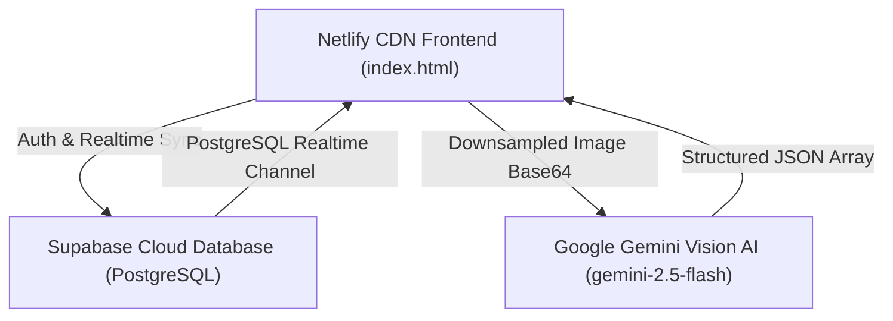

# Aromas Fragrance Inventory & Cloud Dashboard

A modern, high-performance web application designed for luxury fragrance pricing, physical stock tracking, real-time sales reporting, and AI-powered supplier shipment scanning.

---

## 🌟 Executive Overview & Purpose

**Aromas Cloud Vault** provides wholesale fragrance operators, retailers, and inventory partners with a unified platform to manage high-value fragrance inventory across team members. 

Key features include:
- **Physical Commerce Traceability**: Physical batch codes, serial numbers, and bottle glass etchings (e.g., `38U600`, `22Y01`, `02451`) are captured and preserved to guarantee authenticity and vintage tracking.
- **In-App AI Vision Supplier Scanner**: Ingest photos of physical cologne/perfume bottles, shelf stock, or packing slips. Powered by Google Gemini Multimodal Vision API with automatic canvas downsampling and batch code OCR.
- **Bi-Directional Google Sheets Integration**: Copy-paste entire inventory tables directly to and from Google Sheets or Excel with automated TSV delimiter parsing.
- **Real-Time Revenue KPIs**: Instant calculations for Total In-Stock Units, Total Listed Revenue Value, Retail MSRP Value, and Average Customer Savings percentages.
- **OWASP Hardened Security**: Built with DOM node rendering (`textContent`, `replaceChildren`) to strictly neutralize Cross-Site Scripting (XSS) and backed by Supabase Row Level Security (RLS).

---

## 🛠️ Architecture & Tech Stack



- **Frontend**: Single-page application built with HTML5, Vanilla JavaScript (ES6+), and Tailwind CSS with custom glassmorphic dark mode (`#0b0f19` / `#111827`).
- **Cloud Database & Auth**: Supabase JS SDK (`@supabase/supabase-js@2`) providing user authentication, PostgreSQL database storage, and WebSocket real-time data sync.
- **AI Multimodal Processing**: Google Gemini Multimodal Vision API (`gemini-2.5-flash` / `gemini-1.5-flash`) for automated OCR extraction of physical batch codes and bottle properties.
- **Image Processing**: In-browser HTML5 `<canvas>` downsampling engine scaling images to a maximum of 1800x1800 at 85% JPEG quality to optimize network performance.

---

## 📖 Daily Operations Guide

### 1. Google Sheets Import & Export Workflow

#### Importing Rows from Google Sheets
1. Click **Import from Google Sheet** on the action toolbar.
2. In Google Sheets or Excel, select your inventory table rows (including or excluding headers) and copy them (`Ctrl+C` / `Cmd+C`).
3. Expected Column Order:
   `SKU | Fragrance Name | Brand | Concentration | Size | Condition | Listed Price | Retail MSRP | Status | Warehouse`
4. Paste (`Ctrl+V` / `Cmd+V`) into the modal text area and click **Import & Sync Rows**.
5. Rows will be validated, assigned cloud IDs, and saved directly into Supabase.

#### Exporting to Google Sheets
1. Click **Copy for Google Sheets** on the action toolbar.
2. Open your target Google Sheet or Excel workbook.
3. Select cell `A1` (or any starting cell) and press `Ctrl+V` / `Cmd+V`. All columns, tab-separated formats, and monetary values will populate seamlessly.

#### Exporting CSV
1. Click **Export CSV** to instantly download `LOCIONES_2026.csv` with standard comma delimiters and quoted string fields.

---

### 2. Using the AI Supplier Photo Scanner

1. Click **📷 Scan Supplier Photo** on the action toolbar.
2. **Upload / Camera Capture**: Click the drop zone or drag an image file (JPG, PNG, WEBP). On mobile devices, tap to take a photo using the rear camera.
3. **Canvas Compression**: The app automatically downsamples photos exceeding 1800px width/height, keeping uploads under ~400KB.
4. **AI Analysis**: Click **Analyze Photo with Gemini**. An active laser scanning animation will display over the image while Gemini OCR extracts physical batch codes, fragrance names, brands, concentrations (`EDP`, `EDT`, `Parfum`, `Extrait`), bottle volumes, conditions, and estimated market prices.
5. **Review & Edit**:
   - Verify the detected **Physical Batch Code / SKU**. If a bottle's physical code was occluded, a visual warning badge (`⚠️ Batch Check`) appears and can be edited inline.
   - Modify names, brands, or prices inline if needed.
   - Click `✕` to remove any false positive detections or click `+ Add Manual Row` to add missing items.
6. **Batch Commit**: Click **Batch Commit to Vault** to write all verified items into Supabase with `In Stock` status.

---

### 3. Inventory Management & KPI Metrics

- **Status Toggle**: Click **● In Stock** on any table row to flip status to **✓ Sold**. Sold items are dimmed in the table and subtracted from active revenue metrics.
- **KPI Metrics**:
  - **Total In-Stock**: Count of active unsold units.
  - **Listed Price Value**: Gross expected revenue from active inventory.
  - **Retail MSRP Value**: Total original shelf retail value.
  - **Customer Savings**: Difference between MSRP and Listed Price (`MSRP - Listed`).
- **Brand Value Distribution**: Real-time breakdown of dollar inventory value per designer house (Dior, Chanel, Creed, etc.).

---

## 🔒 Security & Access Control

### Supabase Auth & Session Persistence
- User authentication is managed natively through Supabase Auth (`supabase.auth.getSession()` and `supabase.auth.onAuthStateChange()`).
- Session tokens (`sb-<project-ref>-auth-token`) are preserved across browser tab closures and page reloads.
- Clicking **Sign Out** explicitly calls `supabase.auth.signOut()` and purges cached local state.

### OWASP XSS Prevention
- Dynamic table rendering, toast messages, and review tables avoid `innerHTML` string interpolation for user strings.
- All dynamic data is injected into the DOM using safe native properties (`textContent`, `document.createElement()`, `input.value = ...`), guaranteeing untrusted strings are never executed as HTML markup.

### Supabase Row Level Security (RLS) Policies
To ensure unauthenticated API access is strictly prohibited on the Supabase REST endpoint, execute the following SQL policies in the Supabase SQL Editor:

```sql
-- 1. Enable Row Level Security on the inventory table
ALTER TABLE public.inventory ENABLE ROW LEVEL SECURITY;

-- 2. Create policy to allow authenticated users to read inventory
CREATE POLICY "Allow authenticated read access"
ON public.inventory
FOR SELECT
TO authenticated
USING (true);

-- 3. Create policy to allow authenticated users to insert inventory
CREATE POLICY "Allow authenticated insert access"
ON public.inventory
FOR INSERT
TO authenticated
WITH CHECK (true);

-- 4. Create policy to allow authenticated users to update inventory
CREATE POLICY "Allow authenticated update access"
ON public.inventory
FOR UPDATE
TO authenticated
USING (true)
WITH CHECK (true);

-- 5. Create policy to allow authenticated users to delete inventory
CREATE POLICY "Allow authenticated delete access"
ON public.inventory
FOR DELETE
TO authenticated
USING (true);
```

---

## 🚀 Deployment

The repository is configured for automatic deployment on Netlify upon pushing updates to `main`.
To build or deploy locally, serve `index.html` via any standard HTTP server (e.g. `npx serve .` or Live Server).
